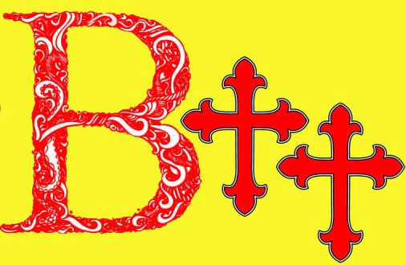

# В†† - первый древнерусский язык программирования


В†† (язык программирования Б крест крест) - это первый язык программирования, написанный на древнерусском языке. 

Идея его создания возникла у нашей команды разработчиков, когда мы поняли, что языков программирования на русском языке 
существует, к сожалению, очень мало. 
Данный язык является экспериментальным образцом, показывающим, что создание подобных языков возможно, а также носит 
развлекательный характер и ссылается на популярный в Интернет среде "мем" про древних Русов.

В нашем проекте реализован синтаксический и лексический анализатор языка В††, имеется графический интерфейс для написания кода.
Также реализована подсветка синтаксиса в соответствии со сгенерированным AST деревом.

Примеры кода вы можете найти в папке examples.
## Запуск проекта

### Linux

Установите файлы CocoR, виртуальное окружение и все необходимые библиотеки с помощью: 
```commandline
build/setup.sh
```

После этого запустите основную программу:
```commandline
python3 src/GUI/main.py 
```

### Windows

Установите файлы CocoR, виртуальное окружение и все необходимые библиотеки с помощью: 
```commandline
build/setup.bat
```
После этого запустите основную программу в файле: 
```
src/GUI/main.py
``` 
